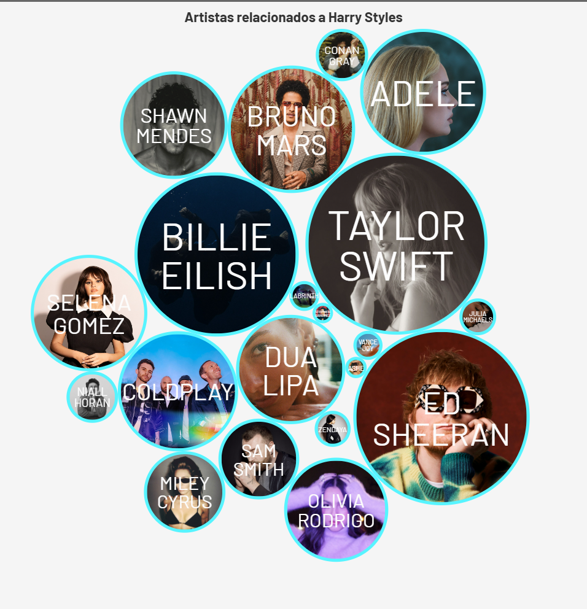
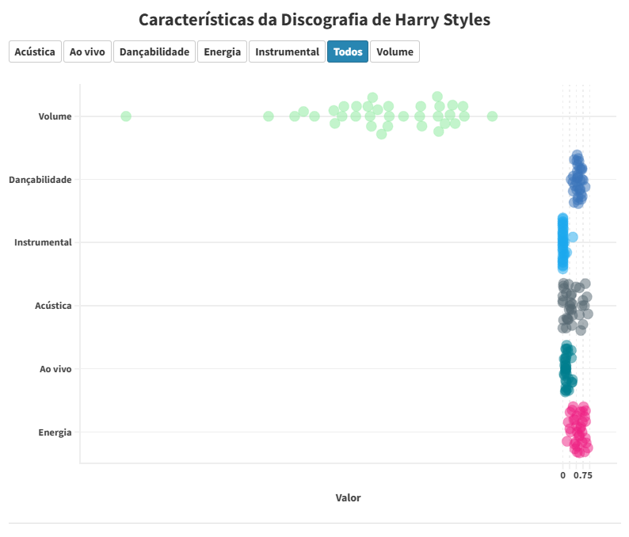

# Análises acerca da Discografia de Harry Styles
Este repositório oferece uma análise de sentimentos das letras de toda a discografia do cantor britâncio Harry Styles e uma avaliação detalhada dos recursos acústicos presentes em sua discografia coletados na API do Spotify. Utilizando técnicas de processamento de linguagem natural (NLP), o projeto explora as nuances emocionais nas letras, bem como elementos acústicos, como danceability e energy.


## ****Objetivo****
O objetivo é entender as características emocionais e acústicas que fazem da discografia de Harry Styles uma experiência única, capturando as diferentes camadas de emoção e expressão presentes em cada álbum. A análise ajuda a traçar um panorama da evolução artística do cantor ao longo dos anos.


## ****Principais Funcionalidades****
1. Análise de Sentimento das Letras: Avaliação de emoções em cada faixa, usando algoritmos NLP para identificar padrões e sentimentos expressos nas letras.
   
2. Extração de Features Acústicos: Exploração de recursos de áudio como acústica, energia, e instrumentalidade através de dados obtidos via APIs de música.
   
3. Visualizações: Gráficos que apresentam os principais insights das letras e atributos acústicos ao longo dos álbuns.


## ****Fonte e coleta de dados****
- [API LyricGenius](https://docs.genius.com/)
  
  
  
- [API do Spotify](https://developer.spotify.com/documentation/web-api/)
  
  
 
As APIs do Spotify e do Lyrics Genius são poderosas ferramentas para extração de dados musicais e de letras, respectivamente. A **Spotify API** permite acesso a uma ampla gama de metadados das faixas, como características acústicas e de análise de áudio, incluindo atributos como *acousticness* (acústica), *danceability* (dançabilidade), *energy* (energia), *valence* (positividade emocional), *tempo* (ritmo), entre outros, que auxiliam na compreensão da estrutura e das emoções nas músicas. Já a **Lyrics Genius API** facilita a obtenção de letras de músicas e informações contextuais sobre cada faixa e álbum, como anotações e interpretações dos versos, além de detalhes sobre o artista e a obra. Combinando essas APIs, é possível realizar uma análise abrangente, correlacionando os dados acústicos das músicas com as emoções e temáticas das letras, criando uma visão rica das intenções artísticas e das características estilísticas de um artista ou álbum.

## Metodologia

### Análise de Sentimentos

Foram coletadas as letras das músicas de Harry Styles, totalizando 35 músicas e 3 álbuns oficiais. Com esses textos, foram aplicadas técnicas de processamento de linguagem natural, como tokenização, para encontrar os termos mais recorrentes nas canções. Para isso, utilizamos a biblioteca Natural Language Toolkit (NLTK).

Em seguida , ocorre a limpeza textual, com a exclusão das stopwords, caracteres especiais e pontuação, e em seguida foi feita a divisão do texto em frases e posteriormente em palavras — ou tokens —, processo chamado de tokenização do corpus.

### **Spotify**

Utilizando a API do Spotify, foi possível coletar dados sobre artistas relacionados a Harry Styles, permitindo uma análise contextual mais ampla. A partir da funcionalidade de recomendação e das redes de similaridade artística, a API fornece informações sobre músicos que compartilham características sonoras ou atraem públicos semelhantes. Esses dados ajudam a entender o posicionamento de Harry Styles no cenário musical e a identificar tendências e influências entre ele e artistas semelhantes, enriquecendo a análise sobre sua discografia e estilo.

  

**Top 10 Spotify**

Com a API do Spotify, foram coletadas as 10 músicas mais populares de Harry Styles, baseando-se em sua popularidade atual na plataforma. Esses dados incluem informações detalhadas sobre cada faixa além de metadados como duração e nome do álbum. Essas informações são essenciais para uma análise precisa, permitindo insights tanto sobre o desempenho das músicas quanto sobre as características sonoras que contribuem para o sucesso das faixas mais ouvidas do artista.

 

**Top 10 Audio Features**

O Spotify dispõe de algumas relacionadas a cada música, como “acústica”, “dançabilidade”, “energia” etc, criadas pela própria plataforma. É possível coletar esses dados e observar se esses indicadores estão mais presentes ou ausentes nas faixas. Eles vão de 0 a 1. Quanto mais próximo de 0, menos presente o indicador tende a estar, e quanto mais próximo de 1, maior a probabilidade de a faixa conter aquela característica. Coletamos esses dados, primeiro, para as músicas presentes no Top 10.


*A explicação dos indicadores pode ser conferida no seguinte link: [Web API Reference | Spotify for Developers](https://developer.spotify.com/documentation/web-api/reference/#/operations/get-audio-features)*

Na visualização a seguir, constam os dados das 35 músicas da discografia de Harry Styles cujos títulos não se repetem.



## Arquivos gerados

- `artistas_relacionados.csv`: artistas relacionados a Harry Styles no Spotify;
- `HarryStyles.db`: Banco de Dados SQL com os dados resultantes da API LyricGenius;
- `HarryStylesLyrics.csv`: arquivo CSV com os dados tratados da API LyricGenius;
- `Lyric_HarryStyles.json`: arquivo JSON resultante da requisição da API LyricGenius;
- `musicas.csv`: features de toda a discografia de Harry Styles no Spotify;
- `musicas_features_long_format.csv`: features separados de toda a discografia de Harry Styles no Spotify;
- `NRC.tsv`: arquivo para análise de sentimentos;
- `top_10.csv`: dados das 10 músicas mais ouvidas no Spotify;
- `top10_feature.csv`: audio features das 10 músicas mais ouvidas no Spotify.

**Como utilizar:**

Para executar os notebooks, é necessário um ambiente com *Python3* e dependências que podem ser instaladas via [Pip](https://pypi.org/project/pip/):

Coleta das letras de músicas usando a API LyricGenius e a criação da WordCloud

```python
!pip install pandas
!pip install lyricgenius
!pip install nltk
```

Acesso à API do Spotify:

```python
!pip install pandas
!pip install spotipy
```
